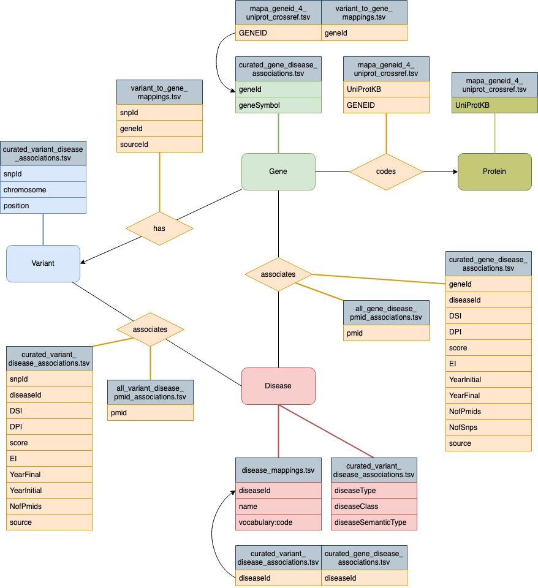

# DisGeNET Parser

https://www.disgenet.org/

Version: DisGeNET v7.0 (2020)

First, a connection to DisGeNET SQLlite is generated.
Then from the file mapa_geneid_4_uniprot_crossref.tsv.gz (UniProt_id, Gene_id) the protein TSV and the edge protein-gene TSV are generated. And the gene_ids are returned as a list.
Next, curated_gene_disease_associations.tsv.gz, variant_to_gene_mappings.tsv.gz, SQLlite, and the gene list are used to prepare the gene TSV file. With variant_to_gene_mappings.tsv.gz the gene-variant edge TSV is prepared, also all variant ids are remembered. With files of curated_gene_disease_associations.tsv.gz, all_gene_disease_pmid_associations.tsv.gz, and the SQLlite the are used to gather the information for gene-disease edges and are written into a TSV file. The disease information is remembered.
Then, the variant TSV information is prepared with the variant list, curated_variant_disease_associations.tsv.gz, and the SQLlite data. Additionally, with curated_variant_disease_associations.tsv.gz, all_variant_disease_pmid_associations.tsv.gz, and SQLlite data the variant-disease edge information is written into a TSV file. Also, here the disease ids are remembered.
In the following, the disease information from the other files and disease_mappings.tsv.gz are combined into one disease TSV file.
In the last step, the different queries for the different nodes and edges are prepared and written into the cypher file.

The script integrates DisGeNet into Neo4j with Neo4j cypher-shell and cypher file.

The schema is shown here:

License: Attribution-NonCommercial-ShareAlike 4.0 International License
