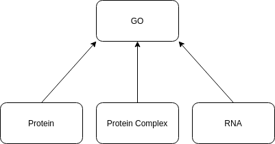

http://geneontology.org/

Version: 2023-04-01

First, the script downloads the latest version of Gene Ontology (GO).

Then the OBO file from the GO will be transformed into node and relationship TSV with the program of EFO/transform_obo_to_tsv_and_cypher_file.py go-basic.obo GO go
All terms are a node in GO all property-value pairs in OBO are a property in the node except for property key='is_a' and 'relationship'. They are for generating different kinds of relationships of the OBO file.
Additionally, the cypher queries for the node and the different kinds of relationships are generated. After this, the data will be integrated into Neo4j with the Neo4j shell.

Next, the goa_human, goa_human_complex, goa_human_isoform, and goa_human_rna files are handled. The TSV files for the RNA, protein, complex nodes are generated. 
Then the cypher queries for the node are added to the cypher file. For the edges, a new cypher file is generated.
Next, the TSV files for the relationships between RNA/protein/complex and go are generated and the additional cypher queries are added to the other cypher file.

In the last step, the nodes and relationships are integrated into Neo4j with the cypher queries from the different programs!

The schema is shown here:

License: CC BY 4.0