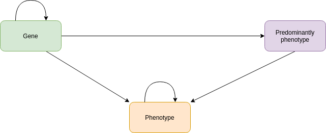

https://www.omim.org/

Version: 2023-04-05

For this, the OMIM academic data (mim2gene.txt, genemap2.txt, morbidmap.txt, mimTitles.txt) are needed to prepare all information for the node and relationship files. Also, a cypher file is generated to integrate the data into Neo4j. It generates nodes with the label gene, phenotype, and predominantly phenotypes. Some nodes have one, two, or all three labels. All are written into different TSV files. Additionally, edges between each other are written into TSV files. Additionally, cypher queries are added which remove the OMIM nodes which has no relationships.

The schema is shown here:

License: https://www.omim.org/help/agreement