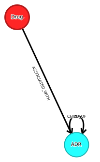

http://www.bio-add.org/ADReCS/

Version: 2024-06-07

BioDWH2 prepare transformation into GraphML file and with the GraphmML importert the data are add to Neo4j.

Schema is below:

License:Creative Commons Attribution-ShareAlike 4.0 International Public License

This is automatically updated.