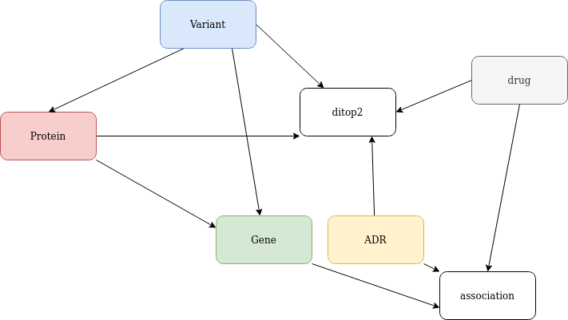

http://www.bio-add.org/ADReCS-Target/index.jsp

The files are downloaded from their homepage version ADReCS-Target 1.0.

Transform the xlsx into TSV files separated into nodes files and relationship files. Additional, empty values were changed to a common symbol
And generate additional cypher files to integrate the nodes and relationships into Noe4j.

ALLTOXI_INFO (sheet all1):	Adverse reaction drug information. [ DITOP2_ID	ADR_ID	ADRECS_ID	ADR_TERM	TOXICITY_DETAIL	ORGAISM	DATA_SOURCE]
I took only the information from sheet all1. Extract from this the ADR nodes with id as string ADR_ID and if not exists the ADR_Term. Toxicity gets its own node.  Also, the connection to DITOP2 is extracted.
sheet all2 has only the same ADR information as sheet all1 but without the edges. Sheet DITOP2_ID2TOXI has IDs of DITOP2 and Toxicity information all this information is in sheet all1.

ALLDRUG_INFO: 	Basical drug information. [Target_ID	BADD_DID	DrugBank_ID	Drug Name	Description	ATC	KEGG	PubChem	Drug_Synonym	NDC	Brand	Indications	Molecular_Formula	CAS]
All information except Target id is for the drug nodes. The target is for the relationship to ditop2.

ADRAlert_LINCS_Gene_inf: 	Basical gene information. [GENE_ID	GENE_SYMBOL	GENE_FULL_NAME	SYNONYMS	CHROMOSOME	MAP_LOCATION	TYPE_OF_GENE	OTHER_DESIGNATIONS	DBXREFS]
All information is used for the gene node.

DITOP_PROTEIN_INFO: 	Basical protein information. [RID	UNIPROT_AC	UNIPROT_ID	Protein names	Gene names	GeneID	Function	String]
For the generation of the protein node the information UNIPROT_AC UNIPROT_ID Protein names and Function. RID is for the connection to DITOP2. And Gene id for relationships from protein to gene.

SNP_Variation_INFO: Basical genetic variation information. [BADD_TID	Variation_ID	UNIPROT_AC	Gene_Name	Gene_ID	Uniprot_ID	Class	Chrom	ChromStart	ChromEnd	Strand	Observed	Alleles	AlleleFreqs	PMID	Link	Data_Source]
All information is integrated into the variant node except BADD_TID, UNIPROT_AC, Gene_Name, Gene_ID, and Uniprot_ID. Uniprot is for protein variant relationship. Gene id is for variant gene relationship and badd tid for relationships to ditop2.

P_D_A: Adverse reaction drug associations with protein information. [BADD_TID	ADR_ID	ADReCS ID	ADR Term	Uniprot AC	Drug_Name]
Prepared the relationship to ditop2 from drug, protein, and ADR.

V_D_A: [BADD_TID	ADR_ID	ADReCS ID	ADR Term	Variation	Drug_Name]
Prepared relationship from ditop2 to ADR, variant, and drug.

ADRAlert2GENE2ID: Association between ADR, drug and gene [ADR ID	Drug_Name	GeneID	ADReCS ID	ADR Term]
The ADReCS ID and ADR ID values are switched! The ADRs are added to the list of ADRs if not existing, the same goes for genes and drugs. Here a new node association is generated to generate the three-point connection between ADR, gene, and drug.

ThreeLever.txt: Contain information of association between ADR, drug and gene/protein/variant. ([ADReCS ID|ADR Term|Drug Name|ID (gene/protein/variant)|Type (GA (protein)/GB (variant)/GC (gene))])
It was not used because the information are all in the other file with the DITOP2 information and in the ADRAlert2GENE2ID. This was manually checked.

schema is show below:

License:  Free for academic use