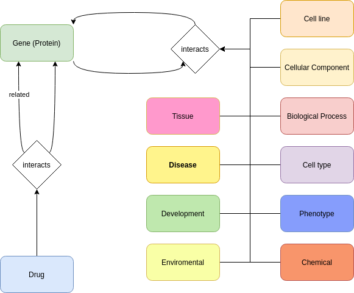

#BioGrid Parser
https://thebiogrid.org/

Version: BIOGRID-4.4.245 (2025-04-25)

First, the data for chemical gene interaction are downloaded. Then for every row in the CSV file the gene, chemical information are extracted and written into a dictionary or the TSV file. However, only the edges are added into a new TSV if the genes are human genes. Additionally, for the relationships and the chemicals, the cypher queries are generated. Also, the Interaction is a node, because sometimes more than one gene and one chemical are related!

Next, the BIOGRID-Organisms are downloaded and only the human file is taken. First, the relationship file and the cypher query are generated. Then for each row in the CSV file, the gene information is extracted. The relationships where both genes are human genes are added to the relationship TSV. The file contains also some ontology information which is separated into different categories and write into a TSV file. Also, the interactions are nodes too.

Last the combined gene information from both files is written into a TSV file.

To update the data in the Python program the version at the top need to be changed.

The schema is shown here:

License: The MIT License (MIT)