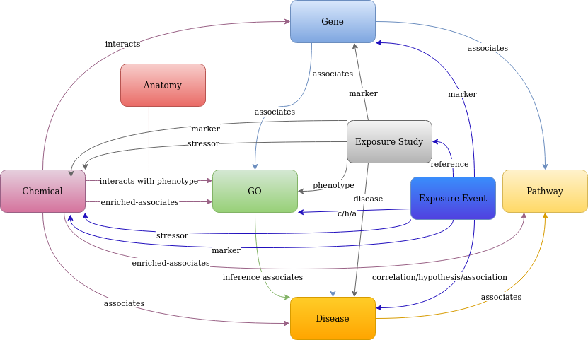

http://ctdbase.org/

Version: 2024-01

There is a script that downloads the file from CTD and prepared the CSV files such that the header on each CSV file is removed. Then run in the program and generated for each file of chemical, disease, gene, anatomy, go, exposre study, exposure event and pathway the cypher query to integrate the node into neo4j.

However, for genes, I prepare a dictionary from gene symbol to gene id.
 The cypher queries are generated for the relationships file.
 The Relationships with GO information were run through to generate a node CSV for the GO terms.
 In the CTD disease-go is the relationship file between gene and go terms generated.
 Also, the exposure files are separated into different files because the exposures are nodes with their own identifier.
 In the end in the cypher file will be queries added which removed all nodes from CTD which has no relationships except chemical.
 Additional, it is possible to execute the program with a reduced integration form it removes from CTD gene-disease and chemical-disease all inference edges. Also, all other inferences or enriched edges are removed from the integration.

The ctd nodes are integraten into Neo4j with Neo4j cypher-shell and the cypher files and the not connected nodes except of chemicals are removed.

The schema is shown below:

License:© 2002–2012 MDI Biological Laboratory. All rights reserved. © 2012-2024 NC State University. All rights reserved. 