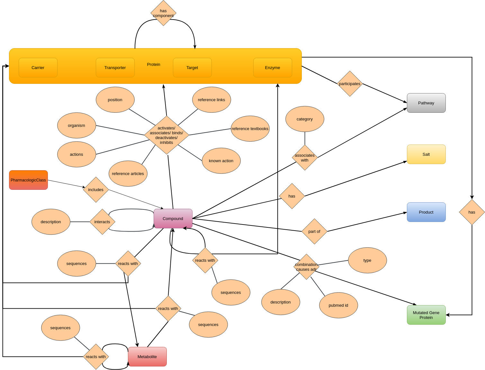

# DrugBank to Neo4j
This integrates all open-source data of DrugBank into Neo4j.

Version: 5.1.13 (2025-01-02)

First, put the Drugbank_database in the other external databases. Then an account is needed to download DrugBank data. Then download the complete database as  XML. This is extracted and the XML into this folder. Next, from structures the full drug structures in SDF format "all", from full metabolite structures the SDF file and from structure external links the "All" CSV file are downloaded. The zip files are added to the directory Drugbank_database/drugbank_files_without_preperation/structure and with the script they can be extracted. Next, from external links, all "All" files are downloaded (total 5 files) and put into Drugbank_database/drugbank_files_without_preperation/external_links and with the script extracted. Then, download from protein identifiers all "All" files (total 4 files) and put them into Drugbank_database/drugbank_files_without_preperation/Protein_identifiers and with the script extracted. In the following, download from target sequences all "All" files (total 4 files) and put them into Drugbank_database/drugbank_files_without_preperation/target_sequences and with the script extracted. From the drug sequence download all files (total 7 files) and put them into Drugbank_database/drugbank_files_without_preperation/drug_sequences and with the script extracted.
The programm to extract the categories does not work anymore, because drugbank made it unavailable to extract data from their website. If the categories.tsv is needed please contact us.

The first step of the DrugBank integration script is to get all DrugBank categories from the API.
The next step is to prepare the SDF files into CSV files.
Then the DrugBank XML file is formed into a tsv file orientated by https://github.com/dhimmel/drugbank/blob/gh-pages/parse.ipynb
with a lot of changes. It takes all information from the file and generates CSV files for targets, carriers, transporter, enzymes, SNPs, pathways, salts, products, metabolites, and pharmacological classes.
Also, the relationships between the different node types are added to CSV files.
After extracting the information from the XML file the information must be combined with the information from the other DrugBank files. Also, the targets are validated with the UniProt identifier (https://github.com/ckoenigs/UniProt_to_Neo4j). The program needs information on where the other DrugBank files are. Also, the generated CSV files from the other program are in a dictionary DrugBank.
In this step are also the cypher queries generated to integrate the different nodes and relationships into Noe4j.
In the last step, the information is integrated into Neo4j with Neo4j cypher-shell.

This should have the form:

The Compound has so many properties:

The Relationships have also some properties:

License: Creative Common's Attribution-NonCommercial 4.0 International License.
