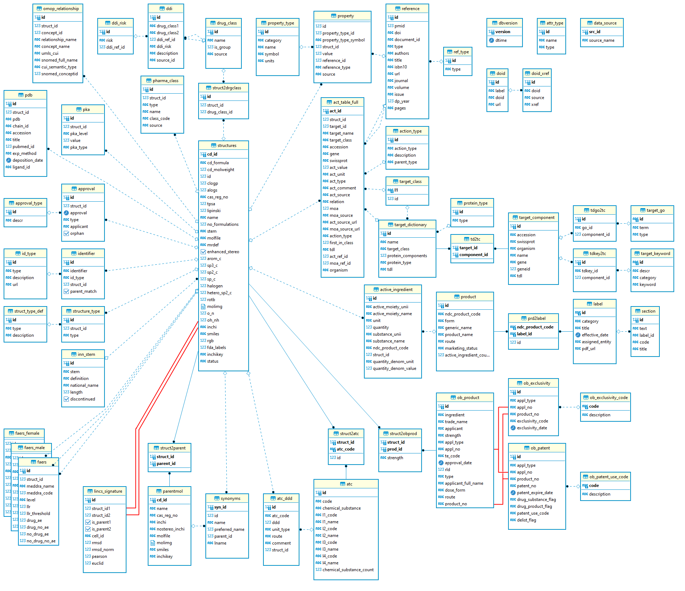
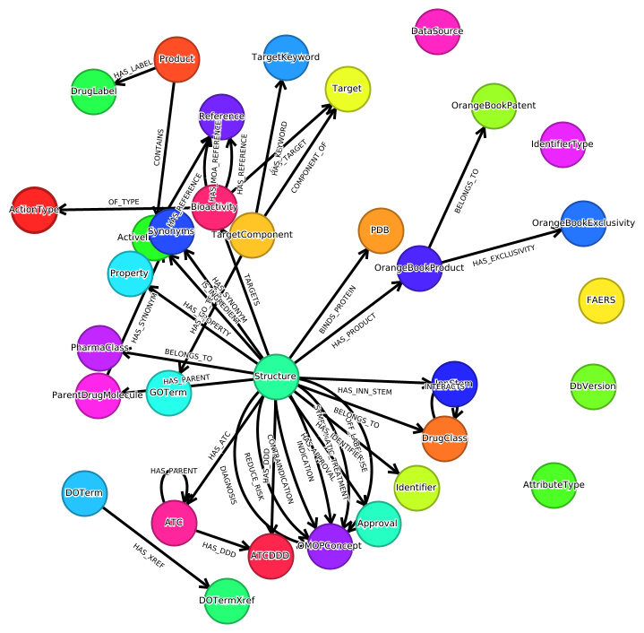

https://drugcentral.org/

Version: 2023-11-01

BioDWH2 prepare transformation into GraphML file and with the GraphmML importert the data are add to Neo4j.

Schema is below:

License:Creative Commons Attribution-ShareAlike 4.0 International Public License