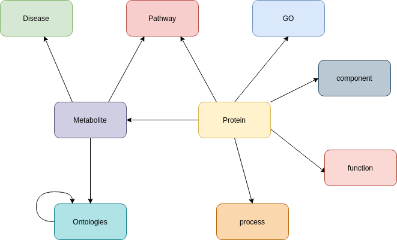

# HMDB

https://hmdb.ca/

Version: 5.0

First, the tsv and cypher queries for the integration are generated for all nodes and relationships.
Then, the HMDB protein zip is downloaded.
Then from the XML file, the protein properties are extracted, but also the relationships to component/function/GO/Metabolite/Pathway/process. For all these other nodes the node properties are also extracted. The node information of component/function/process/protein are direct written into TSV files. The other ones are written into dictionaries. All relationships information is written into tsv files except for protein-metabolite.
Next, the HMDB metabolites zip is downloaded.
From this  XML the metabolite properties are extracted and written into the tsv file.  Also, information about the relationship to different ontologies, diseases, pathways, and proteins are extracted and written into the TSV file except for the one to protein. The disease and ontology information is written into the tsv file. The ontology have also relationships with each other and is written into a tsv file.
In the following, the pathway information from both XML files is written into a tsv file. 
The same goes for the GO nodes.
In the last step, the protein-metabolite information is prepared and written into their tsv file.

The schema is shown here:

License: HMDB is offered to the public as a freely available resource. Use and re-distribution of the data, in whole or in part, for commercial purposes requires explicit permission of the authors and explicit acknowledgment of the source material (HMDB) and the original publication (see below). We ask that users who download significant portions of the database cite the HMDB paper in any resulting publications. Creative Commons (CC) Attribution-NonCommercial (NC) 4.0 International Licensing