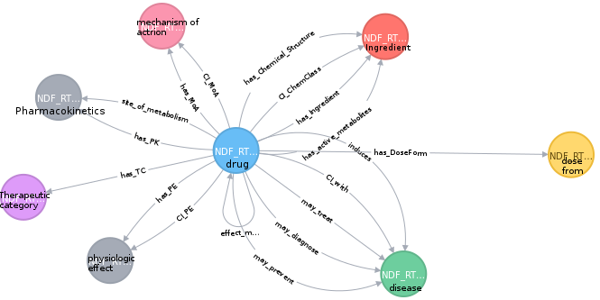

https://evs.nci.nih.gov/ftp1/NDF-RT/

Version 2018-02-05

The program prepare_ndf_rt_to_neo4j_integration.py extracts all information out of ndf-rt XML. These are added into TSV files for nodes and relationships sorted by the kind (label) of the nodes. The same goes for the relationship types. Additionally, a cypher file is generated to integrate the different nodes into Noe4j. The integrated data of ndf-rt will look like this:

Additionally, a cypher file is generated o remove all not connected NDF-RT nodes.

All data are integrated and removed into Neo4j cypher-shell and cypher files.

License: UMLS license, available at https://uts.nlm.nih.gov/license.html

