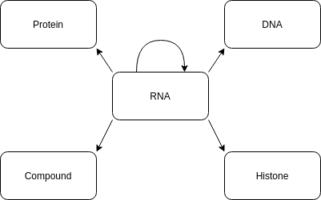

http://www.rnainter.org/

Version: RNAinter v4.0

The script executes import_rnainter with species condition 'Homo sapiens'.
First, the RNA cypher query is added to the cypher file.
Then for each file (Download_data_RR.tar.gz, Download_data_RP.tar.gz, Download_data_RD.tar.gz, Download_data_RC.tar.gz, Download_data_RH.tar.gz), the file is read, and if a species is defined also filtered.
    Then the information for the nodes (RAW_ID, Interactor, Category, species) are are extracted. The first one is every time RNA and this is gathered the information. The second node will have the raw id replaced with an interactor if it is empty. Then it is written into a TSV file and a cypher query is generated and added to the cypher file. This is only done if the second is not RNA. In case it is RNA then it is combined with the other RNA information.
    Next, the returned RNA information is combined with the other RNA information.
    In the following, the edge information is prepared. Also, the empty ray ids are replaced by the interactor information. Then the edge information is written into a TSV file. Additionally, the cypher query is generated and added to the cypher file.
In the end, the RNA information replace the empty raw ids with interactor, all duplication is removed and they are written into the TSV file

Then the script executes the Neo4j cypher-shell to execute the cypher file to integrate the RNA inter information.

The schema is shown here:

License:  Provide data for non-commercial use, distribution, or reproduction in any medium, only if you properly cite the original work.