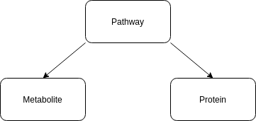

https://smpdb.ca/

Version: 2.75

First, generate a cypher file.
Then, the SMPDB pathway TSV and cypher query are generated. Then the smpdb_pathways.csv.zip is downloaded (SMPDB ID, PW ID, Name, Subject, Description) and the information is prepared and written into the TSV file.
Next, the TSV files and cypher queries are generated for SMPDB metabolite and pathway-metabolite edge. Then, the file smpdb_metabolites.csv.zip (SMPDB ID : pathway, Pathway Name : pathway, Pathway Subject: pathway, Metabolite ID: metabolite, Metabolite Name: metabolite, HMDB ID: metabolite, KEGG ID	: metabolite, ChEBI ID: metabolite, DrugBank ID: metabolite, CAS: metabolite, Formula: metabolite, IUPAC: metabolite, SMILES: metabolite, InChI: metabolite, InChI Key: metabolite) is downloaded and separated into node and edge information and written into the TSV files.
In the last step, the TSV files and cypher queries are generated for SMPDB protein and pathway-protein edge. Then, the file smpdb_proteins.csv.zip (SMPDB ID: pathway, Pathway Name: pathway, Pathway Subject: Pathway, Uniprot ID: protein, Protein Name: protein, HMDBP ID: protein, DrugBank ID: protein, GenBank ID: protein, Gene Name: protein, Locus: protein) is downloaded and separated into node and edge information and written into the TSV files.

Then the script integrates the SMPDB information into Neo4j with the Neo4j cypher-shell.

The schema is shown here:

License: SMPDB is offered to the public as a freely available resource. Use and re-distribution of the data, in whole or in part, for commercial purposes requires explicit permission of the authors and explicit acknowledgment of the source material (SMPDB) and the original publication (see below). We ask that users who download significant portions of the database cite the SMPDB paper in any resulting publications.