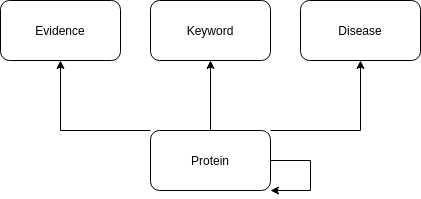

https://www.uniprot.org/

Version: 2024-1 (2024-01-24)

First, prepare the TSV and cypher query for the protein node information.
Depending on if the SwissProt file is there or not the file is downloaded or not.
Then it runs through every entry:
    First, for the protein, it is checked if this is a human protein. If not then go to the next entry.
    Then, it goes through all properties:
        Most properties are part of the protein node: ID, entry, status, sequence length, all AC numbers, synonyms, general function, pathways, subcellular location, protein existence, external references, gene name, gene id, GO classifier, AS sequence, and more. Additionally information about diseases, keywords, and evidence
        But also information about the nodes evidence and keyword is there with the edge information. For them, TSV files and cypher queries are generated and filled.
        From the property comment the information for the disease nodes and the edges for protein-disease and protein information. For them, additional TSV files and cypher queries are generated.

The schema is shown here:

License: CC BY 4.0

This automatically updated if the file is removed from database.