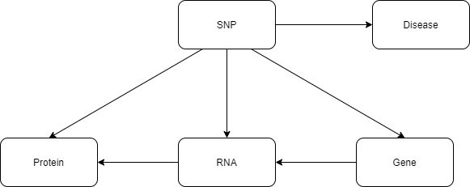

https://www.ncbi.nlm.nih.gov/snp/

Version: 2022-11-16

The script of dbSNP is different from the others. It is because dbSNP is too big. 

This has two parts, first, get the dbSNP information from an API:
    So only for the dbSNP integrated Variants of the other source dbSNP information are downloaded. To download it the API of NCBI is asked. To avoid asking too often all found database information is added to a file. This file information is the first load into the program. 
    Every node has its own JSON entry. So the information is parsed into a dictionary of information. The information is separated into multiple nodes. Because an entry does not only contain the SNP information but also the connection to diseases, genes, RNAs, and proteins.
    Schema:

    

    All nodes and edges are written into TSV files. Additionally, a cypher file is generated to integrate the nodes of dbSNP into Neo4j with a cypher shell.

All nodes are integrated with Neo4j cypher-shell. The edges between the dbSNP nodes and last the connection between Clinvar nodes (Variant) and dbSNP (Variant) are generated.

The second part:
First map the dbSNP Variant to GeneVariant:
    First, a cypher file is generated.
    Then,  the GeneVariants from PharMeBINet are loaded and written into a dictionary.
    Next, the cypher query and the TSV file are prepared.
    Next, the dbSNP snp information is prepared to be written into the TSV file.
    Additionally, files are generated for the additional labels of the nodes with the fitting cypher queries.
    Last, a query is added to delete variant nodes with rs id but no connection to dbSNP variant nodes (the only exception is from DrugBank).
  
Next, the dbSNP genes are mapped to genes:
    First, load the gene information into a dictionary.
    Then, prepare the mapping TSV and cypher query which is added to the existing cypher file.
    The mapping is the NCBI ID of the dbSNP gene to gene ID. The mapping pairs are written into the TSV files.

Both mappings are integrated with cypher-shell.

In the last step, the gene variant-gene edge integration is prepared:
    First, the TSV file and the cypher file with a query are generated for GV-gene pairs integration.
    Then, all pairs are loaded and written into the TSV file.

The edges are integrated with neo4j cypher-shell.

License:https://www.ncbi.nlm.nih.gov/home/about/policies/
